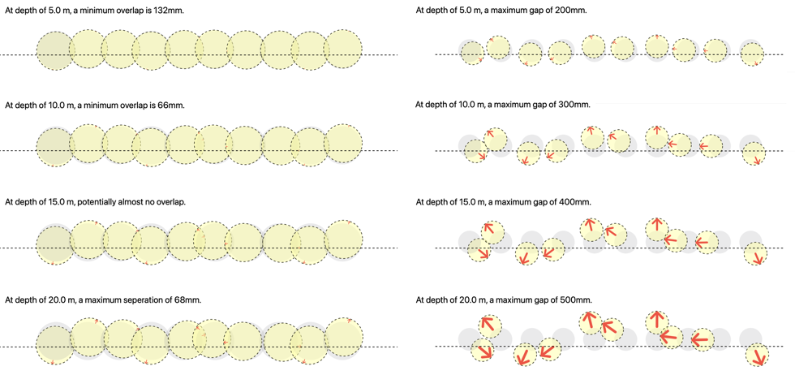

# Visualiser for Shoring Walls

... which consists of a row of piles, allows for the investigation of the potential final layout of the as-built structure at various depths, taking into account the specified tolerance for verticality during installation.

The deviation direction of each pile can be specified by providing a set (array) of angle values in radians. If not specified, these values will be randomly assigned by the program.

Here are some example input and resultant outputs:

<table>
<tr>
<th>
⌀1200mm secant pile wall, 1000mm c/c spacing (200mm overcut), and a verticality tolerance of 1:150.
</th>
<th>
⌀273mm micro piles (tubes), 373mm c/c spacing (100mm gaps), and a verticality tolerance of 1:100.
</th>
</tr>
<tr>
<td>
<pre>

```swift 
let secantPileWall = 
PileRow(pileDia_mm: 1200.0, 
        pileSpacing_mm: 1000.0, 
        verticality_1in: 150.0,
        scale: 0.095)
```
</pre>
</td>
<td>
<pre>

```swift 
let microPiles = 
PileRow(pileDia_mm: 273.0, 
        pileSpacing_mm: 373.0, 
        verticality_1in: 100.0,
        scale: 0.25)
```
</pre>
</td>
</tr>
</table>




You can run this playground inside [Swift Playgrounds](https://en.wikipedia.org/wiki/Swift_Playgrounds) app on iPad or Mac OS. It is recommended to run the playground in full screen mode to avoid any clipping of the drawing.

To use this [SwiftUI View](https://developer.apple.com/xcode/swiftui/) in your own program, simply copy the code provided in the [Playground file](./playground/PileRowVisualiser.playgroundbook). Please do include the copyright notice and this permission notice provided in the [LICENSE](LICENSE). Thank you.